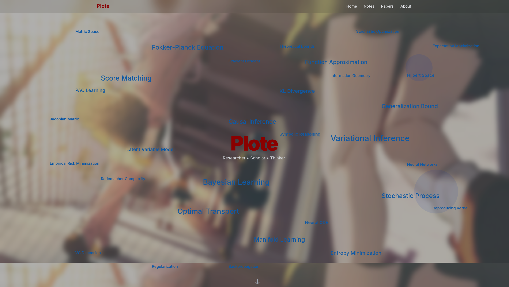

# Plote - 个人学术主页与笔记

这是一个使用 Next.js 构建的。展示了学术背景和研究兴趣，还包含一个支持 Markdown 和 KaTeX 数学公式的笔记系统。



## ✨ 主要特性

- **🚀 高性能框架**: 基于 **Next.js 15** 和 **React 19** 构建，并在开发模式下启用了 **Turbopack** 以获得极致的速度。
- **🎨 现代设计**: 采用 **Tailwind CSS** 构建的深色主题，拥有"毛玻璃"般的半透明模糊背景，视觉效果出众。
- **☁️ 动态词云**: 首页有一个用 **Framer Motion** 实现的、带有平滑动画和交互效果的词云，用于展示核心研究领域。
- **✍️ Markdown 博客/笔记**: 内置一个基于文件的笔记系统，可以直接在 `_notes` 目录中创建和编辑 Markdown 文件。
- **➗ KaTeX 数学公式**: 笔记中完美支持使用 LaTeX 语法编写的数学公式。
- **📜 平滑动画**: 整个网站广泛使用 **Framer Motion** 实现滚动触发的组件动画和细腻的交互反馈。
- **📦 类型安全**: 完全使用 **TypeScript** 编写，保证了代码的健壮性。

## 🛠️ 技术栈

- **框架**: [Next.js](https://nextjs.org/)
- **UI 库**: [React](https://react.dev/)
- **样式**: [Tailwind CSS](https://tailwindcss.com/)
- **动画**: [Framer Motion](https://www.framer.com/motion/)
- **Markdown 处理**: [Unified](https://unifiedjs.com/), [Remark](https://remark.js.org/), [Rehype](https://rehype.js.org/)
- **数学公式**: [KaTeX](https://katex.org/)
- **图标**: [React Icons](https://react-icons.github.io/react-icons/)
- **语言**: [TypeScript](https://www.typescriptlang.org/)

## 🚀 快速上手

1.  **克隆仓库**
    ```bash
    git clone https://github.com/your-username/your-repo-name.git
    cd your-repo-name
    ```

2.  **安装依赖**
    ```bash
    npm install
    ```

3.  **启动开发服务器**
    此项目使用 Turbopack 进行快速开发。
    ```bash
    npm run dev
    ```

4.  在浏览器中打开 `http://localhost:3000` 查看效果。

## 📝 内容管理

### 添加新笔记

1.  在 `_notes` 目录下创建一个新的 `.md` 文件 (例如 `new-note.md`)。
2.  在文件顶部添加 `frontmatter`，包含 `title`, `date`, 和 `summary`。

    ```markdown
    ---
    title: "我的新笔记"
    date: "2024-07-30"
    summary: "这是这篇笔记的简短摘要。"
    ---

    这里是笔记的正文内容，你可以使用 Markdown 语法，甚至可以写数学公式，例如 $E=mc^2$。
    ```

3.  保存文件，它会自动出现在笔记列表中。


